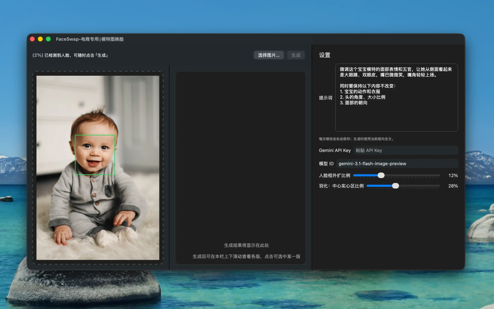

# FaceSwap（电商模特图换脸）

适用于 **macOS** 的桌面工具：在本地用 **Apple Vision** 检测人像人脸区域，将裁切后的人脸图像与用户配置的提示词一并发送至 **Google Gemini（多模态）**/**Kling AI** 生成替换效果，便于电商场景下的模特图处理。

## 功能概要

- 本地人脸检测与可视化选区（Vision）。
- 可调外扩比例的人脸 ROI 裁切与结果拼回（含羽化）。
- 使用用户自备的 **API Key**；
- 生成结果可导出保存；处理流程可在应用内查看进度文字提示。

## 特殊地区不可用提示

- 由于Google AI的政策限制，某些特殊地区的API Key会受限，因此会导致App不可用，此原因并非App问题。
